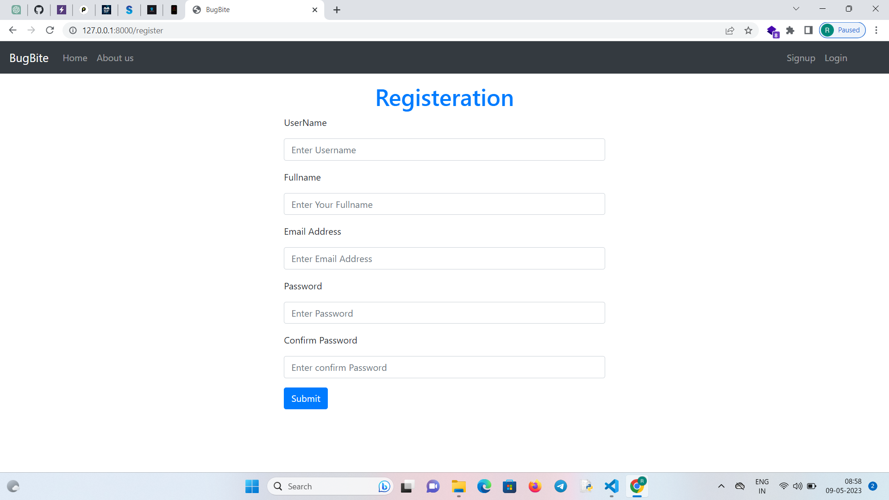
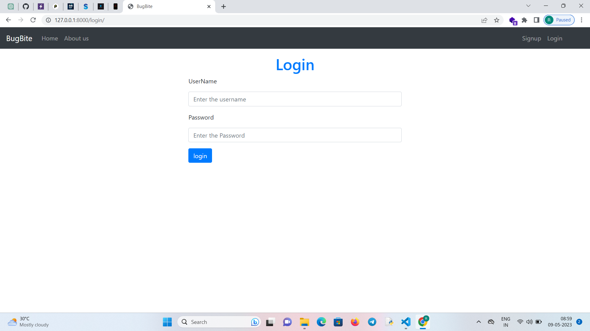
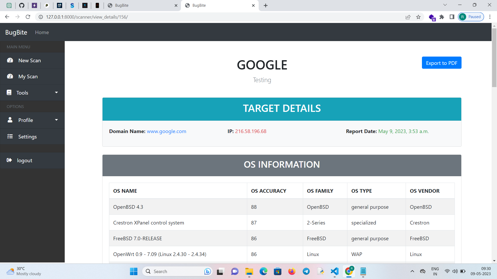
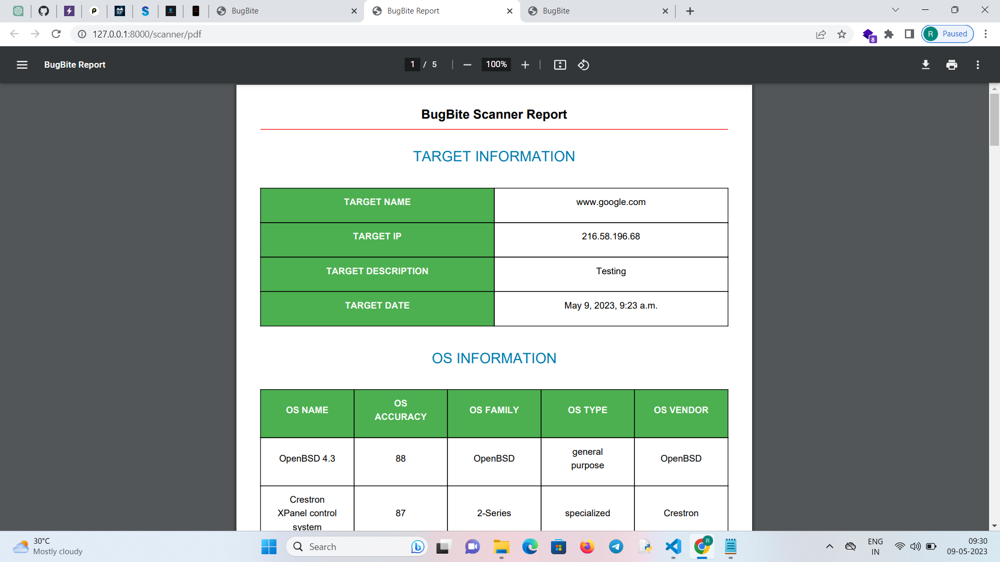

###  SECURING YOUR WEB APPLICATIONS : THE POWER OF BUGBITE VULNERABILITY SCANNER

### ABSTRACT

A BugBite Web Application Vulnerability Scanner is a web application 
designed to identify security weaknesses. BugBite uses a combination of 
techniques including dynamic and static analysis to check for web application 
vulnerabilities such as SQL injection, cross-site scripting (XSS), HTML 
injection, Command injection, Clickjacking, Path traversal, and cross-site 
request forgery (CSRF). The scanner analyzes the web application's code and 
behavior searching for its weaknesses that can be exploited by malicious 
actors. A BugBite Vulnerability Scanner creep the whole website then by 
analyzing individual file and unveils its complete website structure. 
Succeeding this discovery stage, an audit automatically is carried out for 
general security vulnerabilities by the launch of a sequence of Web attacks. 
The Nmap tool is integrated into BugBite to identify vulnerabilities in a 
network system or application by scanning the ports for potential security 
weaknesses. Features such as OS Footprinting and Service Detection are also 
included. Once vulnerabilities are identified, the scanner generates a report 
that highlights the vulnerabilities and provides recommendations for 
remediation 

## Features

* Web Vulnerability scan
* Port Vulnerability scan
* Get OS Information
* Previous scan store
* PDF Report Generate

### Registration Page

### Login Page

### New Scan Page

### My scan Page

### Output Page

### Report Page

